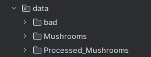

# Computer Vision

## Introduction

In US alone, around 7500 yearly cases of mushrooms poisoning are 
reported [SOURCE](https://www.tandfonline.com/doi/full/10.1080/00275514.2018.1479561). According to the source, 
"misidentification of edible mushroom species appears to be the most common cause 
and may be preventable through education". To avoid expenses for hospitalization 
and in some cases pointless deaths, I have been hired by US National Health 
Service to create a machine learning model, that can recognize mushroom types. 
They want to install this on hand-held devices and to help people make the 
right choice when mushroom picking.

Objectives of this project
<ul>
    <li>Build Data Pipeline</li>
    <li>Preprocess Data</li>
    <li>Build Deep Neural Network</li>
    <li>Evaluate Performance</li>
</ul>

The aim of the Project
Build DNN model which help to identify Edible and Lethal poisonous mushrooms using transfer learning. This project will include data preprocessing, data analysis, model building steps.

The main dataset can be downloaded from [Kaggle](https://www.kaggle.com/maysee/mushrooms-classification-common-genuss-images)

## Requirements for the project

To install all necessary libraries use `pip install -r requirements.txt`

Mushrooms folder with all subclasses should be put in the `data` folder.

## Summary

We found some images which are not usable for NN model and analysis, 
they totally white or corrupted and part of image not loaded. Those images move to 
folder bad and will not be used.

Mushroom dataset consists of 9 different classes, dataset is imbalance. 

Most of the images takes from 50KB to 200KB. 

We worked with of 6711 images, as number is quite low we use image augmentation - 
rotation, flipping, brightness adjustment to create additional images.

Most of the images are 800x580 size.

We created a Neural Network model using backbone of ResNet18 model.
<ul>
    <li>Use CUDA for faster learning</li>
    <li>Fine Tune model</li>
    <li>Set different learning rate for head of model and backbone</li>
    <li>For head use smaller epoch count, increase it while unfreezing the 
backbone of the model</li>
    <li>Saved the best model with the lowest validation loss -> best_model_checkpoint_*.ckpt</li>
    <li>Model evaluated</li>
    <li>Accuracy score with unseen data: 87%</li>
</ul>

## License
This project is licensed under the MIT License - see the LICENSE file for details.

## Contact Information
[Email](ricardas.poskrebysev@gmail.com)
[LinkedIn](https://www.linkedin.com/in/ri%C4%8Dardas-poskreby%C5%A1evas-665207206/)
[GitHub](https://github.com/Riciokzz)